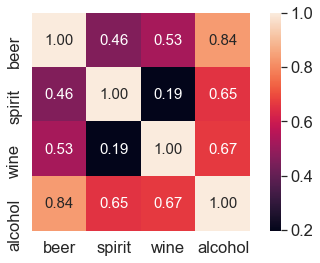
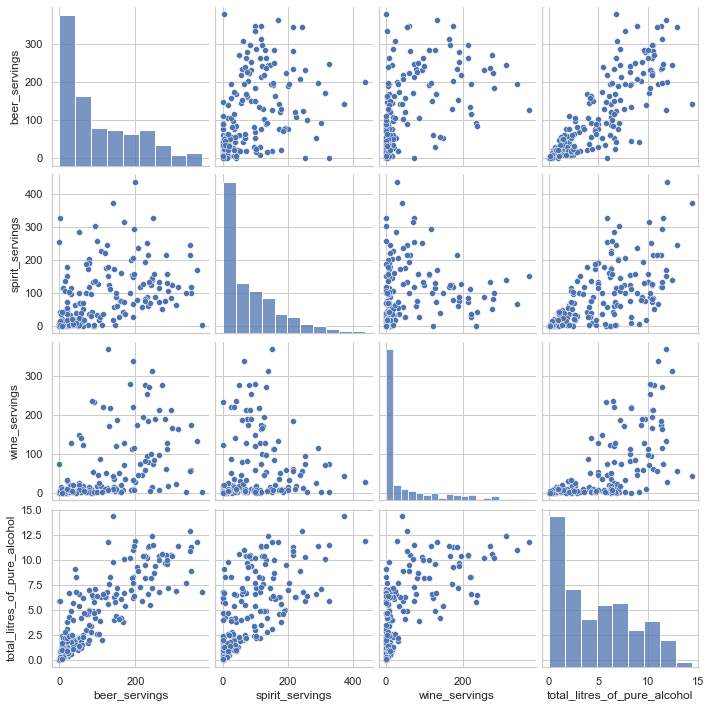
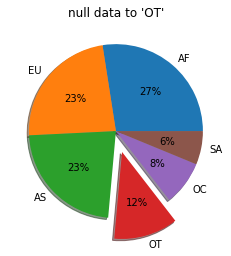
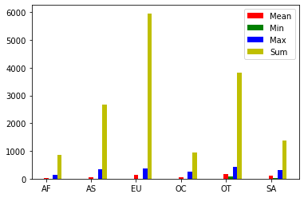
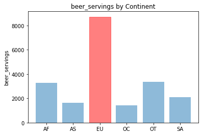
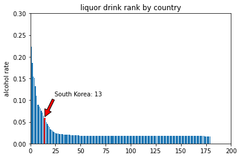

```python
import pandas as pd
import numpy as np
import matplotlib.pyplot as plt

file_path = '../data/drinks.csv'
drinks = pd.read_csv(file_path)
print(drinks.info())
drinks.head(10)
```

    <class 'pandas.core.frame.DataFrame'>
    RangeIndex: 193 entries, 0 to 192
    Data columns (total 6 columns):
     #   Column                        Non-Null Count  Dtype  
    ---  ------                        --------------  -----  
     0   country                       193 non-null    object 
     1   beer_servings                 193 non-null    int64  
     2   spirit_servings               193 non-null    int64  
     3   wine_servings                 193 non-null    int64  
     4   total_litres_of_pure_alcohol  193 non-null    float64
     5   continent                     170 non-null    object 
    dtypes: float64(1), int64(3), object(2)
    memory usage: 9.2+ KB
    None
    


<div>
<style scoped>
    .dataframe tbody tr th:only-of-type {
        vertical-align: middle;
    }

    .dataframe tbody tr th {
        vertical-align: top;
    }

    .dataframe thead th {
        text-align: right;
    }
</style>
<table border="1" class="dataframe">
  <thead>
    <tr style="text-align: right;">
      <th></th>
      <th>country</th>
      <th>beer_servings</th>
      <th>spirit_servings</th>
      <th>wine_servings</th>
      <th>total_litres_of_pure_alcohol</th>
      <th>continent</th>
    </tr>
  </thead>
  <tbody>
    <tr>
      <th>0</th>
      <td>Afghanistan</td>
      <td>0</td>
      <td>0</td>
      <td>0</td>
      <td>0.0</td>
      <td>AS</td>
    </tr>
    <tr>
      <th>1</th>
      <td>Albania</td>
      <td>89</td>
      <td>132</td>
      <td>54</td>
      <td>4.9</td>
      <td>EU</td>
    </tr>
    <tr>
      <th>2</th>
      <td>Algeria</td>
      <td>25</td>
      <td>0</td>
      <td>14</td>
      <td>0.7</td>
      <td>AF</td>
    </tr>
    <tr>
      <th>3</th>
      <td>Andorra</td>
      <td>245</td>
      <td>138</td>
      <td>312</td>
      <td>12.4</td>
      <td>EU</td>
    </tr>
    <tr>
      <th>4</th>
      <td>Angola</td>
      <td>217</td>
      <td>57</td>
      <td>45</td>
      <td>5.9</td>
      <td>AF</td>
    </tr>
    <tr>
      <th>5</th>
      <td>Antigua &amp; Barbuda</td>
      <td>102</td>
      <td>128</td>
      <td>45</td>
      <td>4.9</td>
      <td>NaN</td>
    </tr>
    <tr>
      <th>6</th>
      <td>Argentina</td>
      <td>193</td>
      <td>25</td>
      <td>221</td>
      <td>8.3</td>
      <td>SA</td>
    </tr>
    <tr>
      <th>7</th>
      <td>Armenia</td>
      <td>21</td>
      <td>179</td>
      <td>11</td>
      <td>3.8</td>
      <td>EU</td>
    </tr>
    <tr>
      <th>8</th>
      <td>Australia</td>
      <td>261</td>
      <td>72</td>
      <td>212</td>
      <td>10.4</td>
      <td>OC</td>
    </tr>
    <tr>
      <th>9</th>
      <td>Austria</td>
      <td>279</td>
      <td>75</td>
      <td>191</td>
      <td>9.7</td>
      <td>EU</td>
    </tr>
  </tbody>
</table>
</div>


 - beer_servings : beer 소비량
 - spirit_servings : spirit 소비량
 - wine_servings : wine 소비량
 - total_litres_of_pure_alcohol : 총 알코올 소비량


```python
drinks.describe()
```


<div>
<style scoped>
    .dataframe tbody tr th:only-of-type {
        vertical-align: middle;
    }

    .dataframe tbody tr th {
        vertical-align: top;
    }

    .dataframe thead th {
        text-align: right;
    }
</style>
<table border="1" class="dataframe">
  <thead>
    <tr style="text-align: right;">
      <th></th>
      <th>beer_servings</th>
      <th>spirit_servings</th>
      <th>wine_servings</th>
      <th>total_litres_of_pure_alcohol</th>
    </tr>
  </thead>
  <tbody>
    <tr>
      <th>count</th>
      <td>193.000000</td>
      <td>193.000000</td>
      <td>193.000000</td>
      <td>193.000000</td>
    </tr>
    <tr>
      <th>mean</th>
      <td>106.160622</td>
      <td>80.994819</td>
      <td>49.450777</td>
      <td>4.717098</td>
    </tr>
    <tr>
      <th>std</th>
      <td>101.143103</td>
      <td>88.284312</td>
      <td>79.697598</td>
      <td>3.773298</td>
    </tr>
    <tr>
      <th>min</th>
      <td>0.000000</td>
      <td>0.000000</td>
      <td>0.000000</td>
      <td>0.000000</td>
    </tr>
    <tr>
      <th>25%</th>
      <td>20.000000</td>
      <td>4.000000</td>
      <td>1.000000</td>
      <td>1.300000</td>
    </tr>
    <tr>
      <th>50%</th>
      <td>76.000000</td>
      <td>56.000000</td>
      <td>8.000000</td>
      <td>4.200000</td>
    </tr>
    <tr>
      <th>75%</th>
      <td>188.000000</td>
      <td>128.000000</td>
      <td>59.000000</td>
      <td>7.200000</td>
    </tr>
    <tr>
      <th>max</th>
      <td>376.000000</td>
      <td>438.000000</td>
      <td>370.000000</td>
      <td>14.400000</td>
    </tr>
  </tbody>
</table>
</div>


```python
# 두 피처간 상관계수 구하기
corr = drinks[['beer_servings','wine_servings']].corr(method = 'pearson')
print(corr)
```

                   beer_servings  wine_servings
    beer_servings       1.000000       0.527172
    wine_servings       0.527172       1.000000
    

pearson 메서드는 가장 많이 사용되는 상관계수 계산 방법이다.


```python
cols = ['beer_servings','spirit_servings','wine_servings','total_litres_of_pure_alcohol']
corr = drinks[cols].corr(method = 'pearson')
print(corr)
```

                                  beer_servings  spirit_servings  wine_servings  \
    beer_servings                      1.000000         0.458819       0.527172   
    spirit_servings                    0.458819         1.000000       0.194797   
    wine_servings                      0.527172         0.194797       1.000000   
    total_litres_of_pure_alcohol       0.835839         0.654968       0.667598   
    
                                  total_litres_of_pure_alcohol  
    beer_servings                                     0.835839  
    spirit_servings                                   0.654968  
    wine_servings                                     0.667598  
    total_litres_of_pure_alcohol                      1.000000  
    


```python
# 히트맵
import seaborn as sns
import matplotlib.pyplot as plt

cols_view = ['beer','spirit','wine','alcohol']
sns.set(font_scale=1.5)
hm = sns.heatmap(corr.values,
                cbar = True,
                annot = True,
                square = True,
                fmt = '.2f',
                annot_kws = {'size':15},
                yticklabels = cols_view,
                xticklabels = cols_view)

plt.tight_layout()
plt.show()

sns.set(style = 'whitegrid', context = 'notebook')
sns.pairplot(drinks[['beer_servings','spirit_servings','wine_servings','total_litres_of_pure_alcohol']],height = 2.5)
plt.show()
# cbar - color bar
# annot - box안 숫자표기
# square - box-> 정사각형
# annot_kws = {'size':15} box안 숫자 크기
```


    

    


    

    


```python
# 결측 데이터 전처리
#fillna()함수 이용하여 continent의 결측 데이터를 OT로 일괄 변경
drinks['continent'] = drinks['continent'].fillna('OT')
drinks.head(10)
```


<div>
<style scoped>
    .dataframe tbody tr th:only-of-type {
        vertical-align: middle;
    }

    .dataframe tbody tr th {
        vertical-align: top;
    }

    .dataframe thead th {
        text-align: right;
    }
</style>
<table border="1" class="dataframe">
  <thead>
    <tr style="text-align: right;">
      <th></th>
      <th>country</th>
      <th>beer_servings</th>
      <th>spirit_servings</th>
      <th>wine_servings</th>
      <th>total_litres_of_pure_alcohol</th>
      <th>continent</th>
    </tr>
  </thead>
  <tbody>
    <tr>
      <th>0</th>
      <td>Afghanistan</td>
      <td>0</td>
      <td>0</td>
      <td>0</td>
      <td>0.0</td>
      <td>AS</td>
    </tr>
    <tr>
      <th>1</th>
      <td>Albania</td>
      <td>89</td>
      <td>132</td>
      <td>54</td>
      <td>4.9</td>
      <td>EU</td>
    </tr>
    <tr>
      <th>2</th>
      <td>Algeria</td>
      <td>25</td>
      <td>0</td>
      <td>14</td>
      <td>0.7</td>
      <td>AF</td>
    </tr>
    <tr>
      <th>3</th>
      <td>Andorra</td>
      <td>245</td>
      <td>138</td>
      <td>312</td>
      <td>12.4</td>
      <td>EU</td>
    </tr>
    <tr>
      <th>4</th>
      <td>Angola</td>
      <td>217</td>
      <td>57</td>
      <td>45</td>
      <td>5.9</td>
      <td>AF</td>
    </tr>
    <tr>
      <th>5</th>
      <td>Antigua &amp; Barbuda</td>
      <td>102</td>
      <td>128</td>
      <td>45</td>
      <td>4.9</td>
      <td>OT</td>
    </tr>
    <tr>
      <th>6</th>
      <td>Argentina</td>
      <td>193</td>
      <td>25</td>
      <td>221</td>
      <td>8.3</td>
      <td>SA</td>
    </tr>
    <tr>
      <th>7</th>
      <td>Armenia</td>
      <td>21</td>
      <td>179</td>
      <td>11</td>
      <td>3.8</td>
      <td>EU</td>
    </tr>
    <tr>
      <th>8</th>
      <td>Australia</td>
      <td>261</td>
      <td>72</td>
      <td>212</td>
      <td>10.4</td>
      <td>OC</td>
    </tr>
    <tr>
      <th>9</th>
      <td>Austria</td>
      <td>279</td>
      <td>75</td>
      <td>191</td>
      <td>9.7</td>
      <td>EU</td>
    </tr>
  </tbody>
</table>
</div>


```python
#파이차트 시각화
labels = drinks['continent'].value_counts().index.tolist()
fracs1 = drinks['continent'].value_counts().values.tolist()
explode = (0,0,0,0.25,0,0)

plt.pie(fracs1, explode=explode, labels=labels, autopct = '%.0f%%', shadow=True)
plt.title('null data to \'OT\'')
plt.show()
```


    

    


```python
# agg()함수 이용하여 대륙별 분석
result = drinks.groupby('continent').spirit_servings.agg(['mean','min','max','sum'])
result.head(6)
```


<div>
<style scoped>
    .dataframe tbody tr th:only-of-type {
        vertical-align: middle;
    }

    .dataframe tbody tr th {
        vertical-align: top;
    }

    .dataframe thead th {
        text-align: right;
    }
</style>
<table border="1" class="dataframe">
  <thead>
    <tr style="text-align: right;">
      <th></th>
      <th>mean</th>
      <th>min</th>
      <th>max</th>
      <th>sum</th>
    </tr>
    <tr>
      <th>continent</th>
      <th></th>
      <th></th>
      <th></th>
      <th></th>
    </tr>
  </thead>
  <tbody>
    <tr>
      <th>AF</th>
      <td>16.339623</td>
      <td>0</td>
      <td>152</td>
      <td>866</td>
    </tr>
    <tr>
      <th>AS</th>
      <td>60.840909</td>
      <td>0</td>
      <td>326</td>
      <td>2677</td>
    </tr>
    <tr>
      <th>EU</th>
      <td>132.555556</td>
      <td>0</td>
      <td>373</td>
      <td>5965</td>
    </tr>
    <tr>
      <th>OC</th>
      <td>58.437500</td>
      <td>0</td>
      <td>254</td>
      <td>935</td>
    </tr>
    <tr>
      <th>OT</th>
      <td>165.739130</td>
      <td>68</td>
      <td>438</td>
      <td>3812</td>
    </tr>
    <tr>
      <th>SA</th>
      <td>114.750000</td>
      <td>25</td>
      <td>302</td>
      <td>1377</td>
    </tr>
  </tbody>
</table>
</div>


```python
#전체 평균보다 많은 알코올 섭취하는 대륙 탐색
total_mean = drinks.total_litres_of_pure_alcohol.mean()
continent_mean = drinks.groupby('continent')['total_litres_of_pure_alcohol'].mean()
continent_over_mean = continent_mean[continent_mean >= total_mean]
print(continent_over_mean)
```

    continent
    EU    8.617778
    OT    5.995652
    SA    6.308333
    Name: total_litres_of_pure_alcohol, dtype: float64
    


```python
#평균 beer_servings가 가장 높은 대륙을 구합니다
beer_continent = drinks.groupby('continent').beer_servings.mean().idxmax()
print(beer_continent)
```

    EU
    

- idxmax()는 시리즈 객체에서 값이 제일 큰 index를 반환해준다.


```python
#분석 결과 시각화 / 대륙별 spirit_servings mean,min,max,sum
n_groups = len(result.index)
means = result['mean'].tolist()
mins = result['min'].tolist()
maxs = result['max'].tolist()
sums = result['sum'].tolist()

index = np.arange(n_groups)
bar_width = 0.1

rects1 = plt.bar(index, means, bar_width, color = 'r', label = 'Mean')
rects2 = plt.bar(index + bar_width, mins, bar_width, color = 'g', label = 'Min')
rects3 = plt.bar(index + bar_width*2, maxs, bar_width, color = 'b', label = 'Max')
rects3 = plt.bar(index + bar_width*3, sums, bar_width, color = 'y', label = 'Sum')

plt.xticks(index, result.index.tolist())
plt.legend()
plt.show()
```


    

    


#대륙별 total alcohol 시각화
continents = continent_mean.index.tolist()
continents.append('mean')
x_pos = np.arange(len(continents))
alcohol = continent_mean.tolist()
alcohol.append(total_mean)

bar_list = plt.bar(x_pos, alcohol, align='center', alpha = 0.5)
bar_list[len(continents) - 1].set_color('r')
plt.plot([0.,6], [total_mean, total_mean],"k--")
plt.xticks(x_pos, continents)

plt.ylabel('total_litres_of_pure_alcohol')
plt.title('total_litres_of_pure_alcohol by Continent')

plt.show()


```python
#대륙별 맥주 소비량 시각화
beer_group = drinks.groupby('continent')['beer_servings'].sum()
continents = beer_group.index.tolist()
y_pos = np.arange(len(continents))
alcohol = beer_group.tolist()

bar_list = plt.bar(y_pos, alcohol, align='center', alpha = 0.5)
bar_list[continents.index("EU")].set_color('r')
plt.xticks(y_pos, continents)
plt.ylabel('beer_servings')
plt.title('beer_servings by Continent')

plt.show()
```


    

    


```python
# AF EU 맥주 소비량 차이 검정
africa = drinks.loc[drinks['continent']=='AF']
europe = drinks.loc[drinks['continent']=='EU']

from scipy import stats
tTestResult = stats.ttest_ind(africa['beer_servings'], europe['beer_servings'])
tTestResultDiffVar = stats.ttest_ind(africa['beer_servings'], 
                                    europe['beer_servings'], equal_var = False)

print("The t-statistic and p-value assuming equal variances is %.3f and %.3f." % tTestResult)
print("The t-statistic and p-value assuming equal variances is %.3f and %.3f" % tTestResultDiffVar)
```

    The t-statistic and p-value assuming equal variances is -7.268 and 0.000.
    The t-statistic and p-value assuming equal variances is -7.144 and 0.000
    

- t-test : 두 집단간 평균 차이에 대한 검정 방법 / 모집단의 평균 등으로 검정
- 두 집단의 데이터수가 비슷하고 정규분포를 보이는경우에 신뢰도가 높다.
- 여기서 p-value 값이 0.000이므로 AF,EU 의 맥주소비량 평균은 통계적으로 유의미하다.
- 하지만 두 데이터 수가 다르고 각각의 크기 또한 다르기때문에 좋은 조건은 아님.


```python
# total_servings 피처 생성
drinks['total_servings'] = drinks['beer_servings']+ drinks['wine_servings']+ drinks['spirit_servings']

# 술 소비량 대비 알코올 비율 피처 생성
drinks['alcohol_rate'] = drinks['total_litres_of_pure_alcohol'] / drinks['total_servings']
drinks['alcohol_rate'] = drinks['alcohol_rate'].fillna(0)

# 순위 정보 생성
country_with_rank= drinks[['country','alcohol_rate']]
country_with_rank = country_with_rank.sort_values(by=['alcohol_rate'], ascending=0)
country_with_rank.head(5)
```


<div>
<style scoped>
    .dataframe tbody tr th:only-of-type {
        vertical-align: middle;
    }

    .dataframe tbody tr th {
        vertical-align: top;
    }

    .dataframe thead th {
        text-align: right;
    }
</style>
<table border="1" class="dataframe">
  <thead>
    <tr style="text-align: right;">
      <th></th>
      <th>country</th>
      <th>alcohol_rate</th>
    </tr>
  </thead>
  <tbody>
    <tr>
      <th>63</th>
      <td>Gambia</td>
      <td>0.266667</td>
    </tr>
    <tr>
      <th>153</th>
      <td>Sierra Leone</td>
      <td>0.223333</td>
    </tr>
    <tr>
      <th>124</th>
      <td>Nigeria</td>
      <td>0.185714</td>
    </tr>
    <tr>
      <th>179</th>
      <td>Uganda</td>
      <td>0.153704</td>
    </tr>
    <tr>
      <th>142</th>
      <td>Rwanda</td>
      <td>0.151111</td>
    </tr>
  </tbody>
</table>
</div>


```python
# 국가별 순위 시각화
country_list = country_with_rank.country.tolist()
x_pos = np.arange(len(country_list))
rank = country_with_rank.alcohol_rate.tolist()

bar_list = plt.bar(x_pos, rank)
bar_list[country_list.index('South Korea')].set_color('r')
plt.ylabel('alcohol rate')
plt.title('liquor drink rank by country')
plt.axis([0,200,0,0.3])

korea_rank = country_list.index("South Korea")
korea_alc_rate = country_with_rank[country_with_rank['country']=='South Korea']['alcohol_rate'].values[0]
plt.annotate('South Korea: ' + str(korea_rank -1),
            xy=(korea_rank, korea_alc_rate),
            xytext=(korea_rank +10, korea_alc_rate +0.05),
            arrowprops=dict(facecolor='red', shrink=0.05))

plt.show()
```


    

    


```python

```
