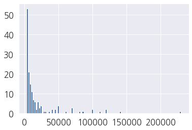
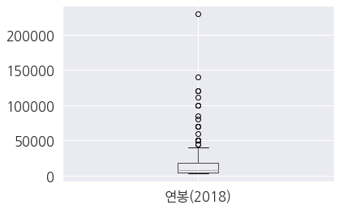
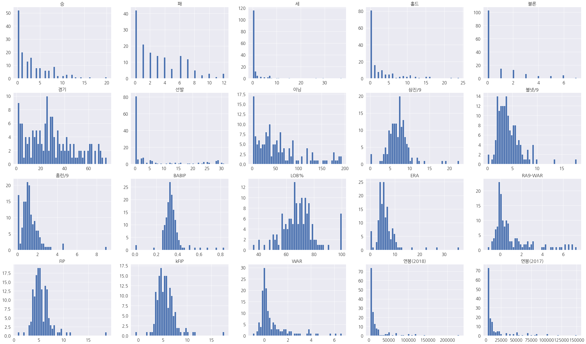
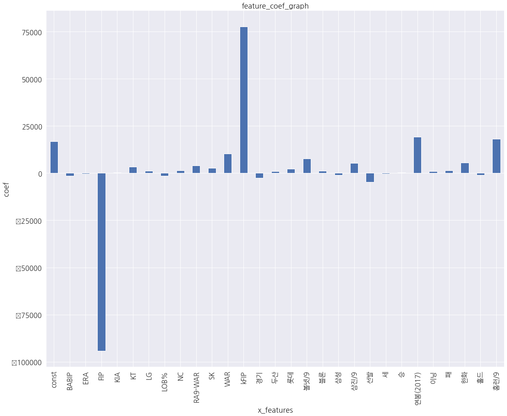
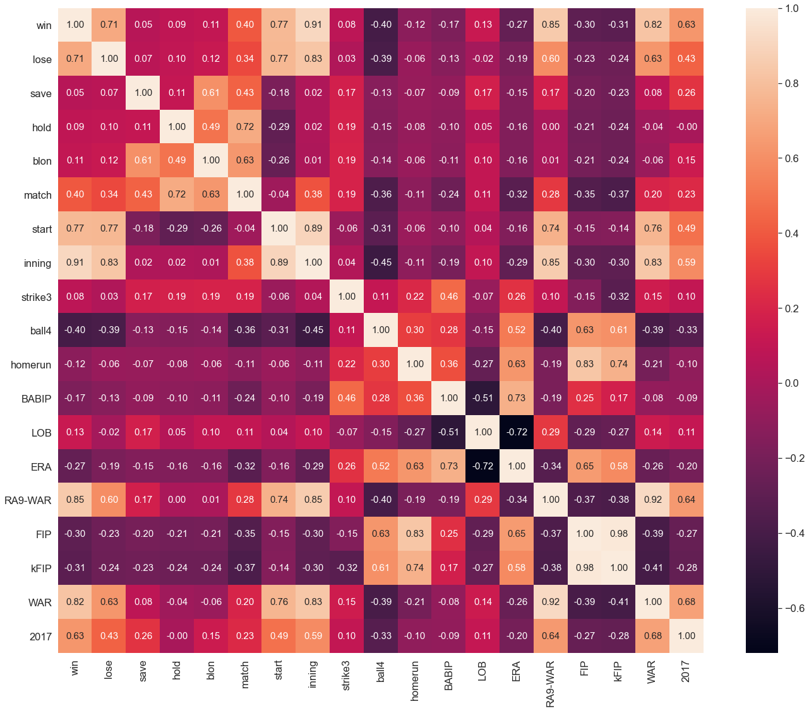
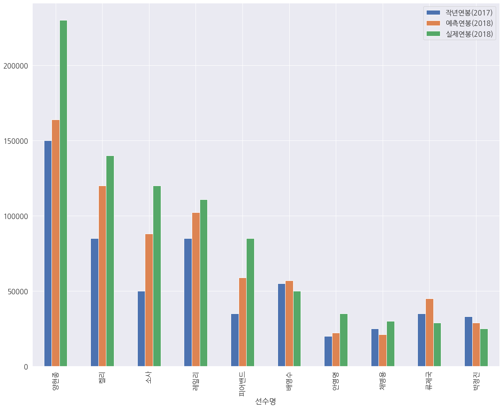

```python
# -*- coding: utf-8 -*-

%matplotlib inline

# 투수, 타자 파일 경로 정의
import pandas as pd
import numpy as np
import matplotlib.pyplot as plt

import warnings
warnings.filterwarnings("ignore")
```


```python
# 투수, 타자 pandas 함수 이용하여 정의
picher_file_path = '../data/picher_stats_2017.csv'
batter_file_path = '../data/batter_stats_2017.csv'
picher = pd.read_csv(picher_file_path)
batter = pd.read_csv(batter_file_path)
```


```python
picher.columns
```


    Index(['선수명', '팀명', '승', '패', '세', '홀드', '블론', '경기', '선발', '이닝', '삼진/9',
           '볼넷/9', '홈런/9', 'BABIP', 'LOB%', 'ERA', 'RA9-WAR', 'FIP', 'kFIP', 'WAR',
           '연봉(2018)', '연봉(2017)'],
          dtype='object')


```python
picher.head()
```


<div>
<style scoped>
    .dataframe tbody tr th:only-of-type {
        vertical-align: middle;
    }

    .dataframe tbody tr th {
        vertical-align: top;
    }

    .dataframe thead th {
        text-align: right;
    }
</style>
<table border="1" class="dataframe">
  <thead>
    <tr style="text-align: right;">
      <th></th>
      <th>선수명</th>
      <th>팀명</th>
      <th>승</th>
      <th>패</th>
      <th>세</th>
      <th>홀드</th>
      <th>블론</th>
      <th>경기</th>
      <th>선발</th>
      <th>이닝</th>
      <th>...</th>
      <th>홈런/9</th>
      <th>BABIP</th>
      <th>LOB%</th>
      <th>ERA</th>
      <th>RA9-WAR</th>
      <th>FIP</th>
      <th>kFIP</th>
      <th>WAR</th>
      <th>연봉(2018)</th>
      <th>연봉(2017)</th>
    </tr>
  </thead>
  <tbody>
    <tr>
      <th>0</th>
      <td>켈리</td>
      <td>SK</td>
      <td>16</td>
      <td>7</td>
      <td>0</td>
      <td>0</td>
      <td>0</td>
      <td>30</td>
      <td>30</td>
      <td>190.0</td>
      <td>...</td>
      <td>0.76</td>
      <td>0.342</td>
      <td>73.7</td>
      <td>3.60</td>
      <td>6.91</td>
      <td>3.69</td>
      <td>3.44</td>
      <td>6.62</td>
      <td>140000</td>
      <td>85000</td>
    </tr>
    <tr>
      <th>1</th>
      <td>소사</td>
      <td>LG</td>
      <td>11</td>
      <td>11</td>
      <td>1</td>
      <td>0</td>
      <td>0</td>
      <td>30</td>
      <td>29</td>
      <td>185.1</td>
      <td>...</td>
      <td>0.53</td>
      <td>0.319</td>
      <td>67.1</td>
      <td>3.88</td>
      <td>6.80</td>
      <td>3.52</td>
      <td>3.41</td>
      <td>6.08</td>
      <td>120000</td>
      <td>50000</td>
    </tr>
    <tr>
      <th>2</th>
      <td>양현종</td>
      <td>KIA</td>
      <td>20</td>
      <td>6</td>
      <td>0</td>
      <td>0</td>
      <td>0</td>
      <td>31</td>
      <td>31</td>
      <td>193.1</td>
      <td>...</td>
      <td>0.79</td>
      <td>0.332</td>
      <td>72.1</td>
      <td>3.44</td>
      <td>6.54</td>
      <td>3.94</td>
      <td>3.82</td>
      <td>5.64</td>
      <td>230000</td>
      <td>150000</td>
    </tr>
    <tr>
      <th>3</th>
      <td>차우찬</td>
      <td>LG</td>
      <td>10</td>
      <td>7</td>
      <td>0</td>
      <td>0</td>
      <td>0</td>
      <td>28</td>
      <td>28</td>
      <td>175.2</td>
      <td>...</td>
      <td>1.02</td>
      <td>0.298</td>
      <td>75.0</td>
      <td>3.43</td>
      <td>6.11</td>
      <td>4.20</td>
      <td>4.03</td>
      <td>4.63</td>
      <td>100000</td>
      <td>100000</td>
    </tr>
    <tr>
      <th>4</th>
      <td>레일리</td>
      <td>롯데</td>
      <td>13</td>
      <td>7</td>
      <td>0</td>
      <td>0</td>
      <td>0</td>
      <td>30</td>
      <td>30</td>
      <td>187.1</td>
      <td>...</td>
      <td>0.91</td>
      <td>0.323</td>
      <td>74.1</td>
      <td>3.80</td>
      <td>6.13</td>
      <td>4.36</td>
      <td>4.31</td>
      <td>4.38</td>
      <td>111000</td>
      <td>85000</td>
    </tr>
  </tbody>
</table>
<p>5 rows × 22 columns</p>
</div>


```python
print(picher.shape)
```

    (152, 22)
    

-----


```python
import matplotlib as mpl
set(sorted([f.name for f in mpl.font_manager.fontManager.ttflist])) # 현재 OS 내에 설치된 폰트를 확인합니다.
```


    {'Agency FB',
     'Algerian',
     'Ami R',
     'Arial',
     'Arial Rounded MT Bold',
     'Bahnschrift',
     'Baskerville Old Face',
     'Batang',
     'Bauhaus 93',
     'Bell MT',
     'Berlin Sans FB',
     'Berlin Sans FB Demi',
     'Bernard MT Condensed',
     'Blackadder ITC',
     'Bodoni MT',
     'Book Antiqua',
     'Bookman Old Style',
     'Bookshelf Symbol 7',
     'Bradley Hand ITC',
     'Britannic Bold',
     'Broadway',
     'Brush Script MT',
     'Calibri',
     'Californian FB',
     'Calisto MT',
     'Cambria',
     'Candara',
     'Castellar',
     'Centaur',
     'Century',
     'Century Gothic',
     'Century Schoolbook',
     'Chiller',
     'Colonna MT',
     'Comic Sans MS',
     'Consolas',
     'Constantia',
     'Cooper Black',
     'Copperplate Gothic Bold',
     'Copperplate Gothic Light',
     'Corbel',
     'Courier New',
     'Curlz MT',
     'DejaVu Sans',
     'DejaVu Sans Display',
     'DejaVu Sans Mono',
     'DejaVu Serif',
     'DejaVu Serif Display',
     'Dubai',
     'Ebrima',
     'Edwardian Script ITC',
     'Elephant',
     'Engravers MT',
     'Eras Bold ITC',
     'Eras Demi ITC',
     'Eras Light ITC',
     'Eras Medium ITC',
     'Felix Titling',
     'Footlight MT Light',
     'Forte',
     'Franklin Gothic Book',
     'Franklin Gothic Demi',
     'Franklin Gothic Demi Cond',
     'Franklin Gothic Heavy',
     'Franklin Gothic Medium',
     'Franklin Gothic Medium Cond',
     'Freestyle Script',
     'French Script MT',
     'Gabriola',
     'Gadugi',
     'Garamond',
     'Georgia',
     'Gigi',
     'Gill Sans MT',
     'Gill Sans MT Condensed',
     'Gill Sans MT Ext Condensed Bold',
     'Gill Sans Ultra Bold',
     'Gill Sans Ultra Bold Condensed',
     'Gloucester MT Extra Condensed',
     'Goudy Old Style',
     'Goudy Stout',
     'Gulim',
     'HCR Batang',
     'HCR Batang Ext',
     'HCR Batang ExtB',
     'HCR Dotum',
     'HCR Dotum Ext',
     'HYGothic-Extra',
     'HYGothic-Medium',
     'HYGraphic-Medium',
     'HYGungSo-Bold',
     'HYHeadLine-Medium',
     'HYMyeongJo-Extra',
     'HYPMokGak-Bold',
     'HYPost-Light',
     'HYPost-Medium',
     'HYShortSamul-Medium',
     'HYSinMyeongJo-Medium',
     'Haettenschweiler',
     'Harlow Solid Italic',
     'Harrington',
     'Headline R',
     'High Tower Text',
     'HoloLens MDL2 Assets',
     'HyhwpEQ',
     'Impact',
     'Imprint MT Shadow',
     'Informal Roman',
     'Ink Free',
     'Javanese Text',
     'Jokerman',
     'Juice ITC',
     'Kristen ITC',
     'Kunstler Script',
     'Leelawadee',
     'Leelawadee UI',
     'Lucida Bright',
     'Lucida Calligraphy',
     'Lucida Console',
     'Lucida Fax',
     'Lucida Handwriting',
     'Lucida Sans',
     'Lucida Sans Typewriter',
     'Lucida Sans Unicode',
     'MBatang',
     'MDotum',
     'MGungHeulim',
     'MGungJeong',
     'MHunmin',
     'MJemokBatang',
     'MJemokGothic',
     'MS Gothic',
     'MS Outlook',
     'MS Reference Sans Serif',
     'MS Reference Specialty',
     'MSugiHeulim',
     'MSugiJeong',
     'MT Extra',
     'MV Boli',
     'Magic R',
     'Magneto',
     'Maiandra GD',
     'Malgun Gothic',
     'Marlett',
     'Matura MT Script Capitals',
     'Microsoft Himalaya',
     'Microsoft JhengHei',
     'Microsoft New Tai Lue',
     'Microsoft PhagsPa',
     'Microsoft Sans Serif',
     'Microsoft Tai Le',
     'Microsoft Uighur',
     'Microsoft YaHei',
     'Microsoft Yi Baiti',
     'MingLiU-ExtB',
     'Mistral',
     'Modern No. 20',
     'MoeumT R',
     'Mongolian Baiti',
     'Monotype Corsiva',
     'Myanmar Text',
     'NanumGothic',
     'New Gulim',
     'NewJumja',
     'Niagara Engraved',
     'Niagara Solid',
     'Nirmala UI',
     'OCR A Extended',
     'Old English Text MT',
     'Onyx',
     'Palace Script MT',
     'Palatino Linotype',
     'Papyrus',
     'Parchment',
     'Perpetua',
     'Perpetua Titling MT',
     'Playbill',
     'Poor Richard',
     'Pristina',
     'Pyunji R',
     'Rage Italic',
     'Ravie',
     'Rockwell',
     'Rockwell Condensed',
     'Rockwell Extra Bold',
     'STIXGeneral',
     'STIXNonUnicode',
     'STIXSizeFiveSym',
     'STIXSizeFourSym',
     'STIXSizeOneSym',
     'STIXSizeThreeSym',
     'STIXSizeTwoSym',
     'Script MT Bold',
     'Segoe MDL2 Assets',
     'Segoe Print',
     'Segoe Script',
     'Segoe UI',
     'Segoe UI Emoji',
     'Segoe UI Historic',
     'Segoe UI Symbol',
     'Showcard Gothic',
     'SimSun',
     'SimSun-ExtB',
     'Sitka Small',
     'Snap ITC',
     'SpoqaHanSans',
     'Stencil',
     'Sylfaen',
     'Symbol',
     'Tahoma',
     'Tempus Sans ITC',
     'Times New Roman',
     'Trebuchet MS',
     'Tw Cen MT',
     'Tw Cen MT Condensed',
     'Tw Cen MT Condensed Extra Bold',
     'V3Detect',
     'Verdana',
     'Viner Hand ITC',
     'Vivaldi',
     'Vladimir Script',
     'Webdings',
     'Wide Latin',
     'Wingdings',
     'Wingdings 2',
     'Wingdings 3',
     'Yet R',
     'Yu Gothic',
     'cmb10',
     'cmex10',
     'cmmi10',
     'cmr10',
     'cmss10',
     'cmsy10',
     'cmtt10',
     'qtquickcontrols'}


```python
mpl.rc('font', family='NanumGothic')
```


```python
picher['연봉(2018)'].describe()
```


    count       152.000000
    mean      18932.236842
    std       30940.732924
    min        2700.000000
    25%        4000.000000
    50%        7550.000000
    75%       18500.000000
    max      230000.000000
    Name: 연봉(2018), dtype: float64


```python
picher['연봉(2018)'].hist(bins=100)
```


    <AxesSubplot:>


    

    


- bins 는 split 개수로 생각하면 되고 입력이 안될경우 10이 default


```python
picher.boxplot(column=['연봉(2018)'])
```


    <AxesSubplot:>


    

    


- 5억 미만의 연봉이 일반적


```python
picher_features_df = picher[['승', '패', '세', '홀드', '블론', '경기', '선발', '이닝', '삼진/9',
       '볼넷/9', '홈런/9', 'BABIP', 'LOB%', 'ERA', 'RA9-WAR', 'FIP', 'kFIP', 'WAR',
       '연봉(2018)', '연봉(2017)']]
```


```python
# 피처 각각에 대한 histogram을 출력
def plot_hist_each_column(df):
    plt.rcParams['figure.figsize'] = [40, 30]
    fig = plt.figure(1)
    
    # df의 column 갯수 만큼의 subplot을 출력
    for i in range(len(df.columns)):
        ax = fig.add_subplot(5, 5, i+1)
        plt.hist(df[df.columns[i]], bins=50)
        ax.set_title(df.columns[i])
    plt.show()
```


```python
plot_hist_each_column(picher_features_df)
```


    

    


- 그래프를 보면 피처간 단위가 모두 다르다 따라서 피처의 정규화나 스케일링 작업이 필요하다
- 상대적인 값으로 만들어 주어 0~1 사이 값으로 분포 시키는것으로 예를 들수 있다.


```python
# 판다스 형태로된 데이터 출력시 scientific-natation이 아닌 float 모양으로 출력되게 해준다.
pd.options.mode.chained_assignment = None
```


```python
# 피처 각각에 대한 scaling을 수행하는 함수를 정의
def standard_scaling(df, scale_columns):
    for col in scale_columns:
        series_mean = df[col].mean()
        series_std = df[col].std()
        df[col] = df[col].apply(lambda x: (x-series_mean)/series_std)
    return df
```


```python
# 피처 각각에 대한 scaling을 수행
scale_columns = ['승', '패', '세', '홀드', '블론', '경기', '선발', '이닝', '삼진/9',
       '볼넷/9', '홈런/9', 'BABIP', 'LOB%', 'ERA', 'RA9-WAR', 'FIP', 'kFIP', 'WAR', '연봉(2017)']
picher_df = standard_scaling(picher, scale_columns)
```


```python
picher_df = picher_df.rename(columns={'연봉(2018)': 'y'})
picher_df.head(5)
```


<div>
<style scoped>
    .dataframe tbody tr th:only-of-type {
        vertical-align: middle;
    }

    .dataframe tbody tr th {
        vertical-align: top;
    }

    .dataframe thead th {
        text-align: right;
    }
</style>
<table border="1" class="dataframe">
  <thead>
    <tr style="text-align: right;">
      <th></th>
      <th>선수명</th>
      <th>팀명</th>
      <th>승</th>
      <th>패</th>
      <th>세</th>
      <th>홀드</th>
      <th>블론</th>
      <th>경기</th>
      <th>선발</th>
      <th>이닝</th>
      <th>...</th>
      <th>홈런/9</th>
      <th>BABIP</th>
      <th>LOB%</th>
      <th>ERA</th>
      <th>RA9-WAR</th>
      <th>FIP</th>
      <th>kFIP</th>
      <th>WAR</th>
      <th>y</th>
      <th>연봉(2017)</th>
    </tr>
  </thead>
  <tbody>
    <tr>
      <th>0</th>
      <td>켈리</td>
      <td>SK</td>
      <td>3.313623</td>
      <td>1.227145</td>
      <td>-0.306452</td>
      <td>-0.585705</td>
      <td>-0.543592</td>
      <td>0.059433</td>
      <td>2.452068</td>
      <td>2.645175</td>
      <td>...</td>
      <td>-0.442382</td>
      <td>0.016783</td>
      <td>0.446615</td>
      <td>-0.587056</td>
      <td>3.174630</td>
      <td>-0.971030</td>
      <td>-1.058125</td>
      <td>4.503142</td>
      <td>140000</td>
      <td>2.734705</td>
    </tr>
    <tr>
      <th>1</th>
      <td>소사</td>
      <td>LG</td>
      <td>2.019505</td>
      <td>2.504721</td>
      <td>-0.098502</td>
      <td>-0.585705</td>
      <td>-0.543592</td>
      <td>0.059433</td>
      <td>2.349505</td>
      <td>2.547755</td>
      <td>...</td>
      <td>-0.668521</td>
      <td>-0.241686</td>
      <td>-0.122764</td>
      <td>-0.519855</td>
      <td>3.114968</td>
      <td>-1.061888</td>
      <td>-1.073265</td>
      <td>4.094734</td>
      <td>120000</td>
      <td>1.337303</td>
    </tr>
    <tr>
      <th>2</th>
      <td>양현종</td>
      <td>KIA</td>
      <td>4.348918</td>
      <td>0.907751</td>
      <td>-0.306452</td>
      <td>-0.585705</td>
      <td>-0.543592</td>
      <td>0.111056</td>
      <td>2.554632</td>
      <td>2.706808</td>
      <td>...</td>
      <td>-0.412886</td>
      <td>-0.095595</td>
      <td>0.308584</td>
      <td>-0.625456</td>
      <td>2.973948</td>
      <td>-0.837415</td>
      <td>-0.866361</td>
      <td>3.761956</td>
      <td>230000</td>
      <td>5.329881</td>
    </tr>
    <tr>
      <th>3</th>
      <td>차우찬</td>
      <td>LG</td>
      <td>1.760682</td>
      <td>1.227145</td>
      <td>-0.306452</td>
      <td>-0.585705</td>
      <td>-0.543592</td>
      <td>-0.043811</td>
      <td>2.246942</td>
      <td>2.350927</td>
      <td>...</td>
      <td>-0.186746</td>
      <td>-0.477680</td>
      <td>0.558765</td>
      <td>-0.627856</td>
      <td>2.740722</td>
      <td>-0.698455</td>
      <td>-0.760385</td>
      <td>2.998081</td>
      <td>100000</td>
      <td>3.333592</td>
    </tr>
    <tr>
      <th>4</th>
      <td>레일리</td>
      <td>롯데</td>
      <td>2.537153</td>
      <td>1.227145</td>
      <td>-0.306452</td>
      <td>-0.585705</td>
      <td>-0.543592</td>
      <td>0.059433</td>
      <td>2.452068</td>
      <td>2.587518</td>
      <td>...</td>
      <td>-0.294900</td>
      <td>-0.196735</td>
      <td>0.481122</td>
      <td>-0.539055</td>
      <td>2.751570</td>
      <td>-0.612941</td>
      <td>-0.619085</td>
      <td>2.809003</td>
      <td>111000</td>
      <td>2.734705</td>
    </tr>
  </tbody>
</table>
<p>5 rows × 22 columns</p>
</div>


```python
# 연속형이 아닌 범주형 피처들은 원-핫 인코딩을 통해 정규화를 해준다
# 판다스에서는 get_dummies()로 적용

team_encoding = pd.get_dummies(picher_df['팀명'])
picher_df = picher_df.drop('팀명', axis=1)
picher_df = picher_df.join(team_encoding)
```


```python
team_encoding.head(5)
```


<div>
<style scoped>
    .dataframe tbody tr th:only-of-type {
        vertical-align: middle;
    }

    .dataframe tbody tr th {
        vertical-align: top;
    }

    .dataframe thead th {
        text-align: right;
    }
</style>
<table border="1" class="dataframe">
  <thead>
    <tr style="text-align: right;">
      <th></th>
      <th>KIA</th>
      <th>KT</th>
      <th>LG</th>
      <th>NC</th>
      <th>SK</th>
      <th>두산</th>
      <th>롯데</th>
      <th>삼성</th>
      <th>한화</th>
    </tr>
  </thead>
  <tbody>
    <tr>
      <th>0</th>
      <td>0</td>
      <td>0</td>
      <td>0</td>
      <td>0</td>
      <td>1</td>
      <td>0</td>
      <td>0</td>
      <td>0</td>
      <td>0</td>
    </tr>
    <tr>
      <th>1</th>
      <td>0</td>
      <td>0</td>
      <td>1</td>
      <td>0</td>
      <td>0</td>
      <td>0</td>
      <td>0</td>
      <td>0</td>
      <td>0</td>
    </tr>
    <tr>
      <th>2</th>
      <td>1</td>
      <td>0</td>
      <td>0</td>
      <td>0</td>
      <td>0</td>
      <td>0</td>
      <td>0</td>
      <td>0</td>
      <td>0</td>
    </tr>
    <tr>
      <th>3</th>
      <td>0</td>
      <td>0</td>
      <td>1</td>
      <td>0</td>
      <td>0</td>
      <td>0</td>
      <td>0</td>
      <td>0</td>
      <td>0</td>
    </tr>
    <tr>
      <th>4</th>
      <td>0</td>
      <td>0</td>
      <td>0</td>
      <td>0</td>
      <td>0</td>
      <td>0</td>
      <td>1</td>
      <td>0</td>
      <td>0</td>
    </tr>
  </tbody>
</table>
</div>


```python
picher_df.head()
```


<div>
<style scoped>
    .dataframe tbody tr th:only-of-type {
        vertical-align: middle;
    }

    .dataframe tbody tr th {
        vertical-align: top;
    }

    .dataframe thead th {
        text-align: right;
    }
</style>
<table border="1" class="dataframe">
  <thead>
    <tr style="text-align: right;">
      <th></th>
      <th>선수명</th>
      <th>승</th>
      <th>패</th>
      <th>세</th>
      <th>홀드</th>
      <th>블론</th>
      <th>경기</th>
      <th>선발</th>
      <th>이닝</th>
      <th>삼진/9</th>
      <th>...</th>
      <th>연봉(2017)</th>
      <th>KIA</th>
      <th>KT</th>
      <th>LG</th>
      <th>NC</th>
      <th>SK</th>
      <th>두산</th>
      <th>롯데</th>
      <th>삼성</th>
      <th>한화</th>
    </tr>
  </thead>
  <tbody>
    <tr>
      <th>0</th>
      <td>켈리</td>
      <td>3.313623</td>
      <td>1.227145</td>
      <td>-0.306452</td>
      <td>-0.585705</td>
      <td>-0.543592</td>
      <td>0.059433</td>
      <td>2.452068</td>
      <td>2.645175</td>
      <td>0.672099</td>
      <td>...</td>
      <td>2.734705</td>
      <td>0</td>
      <td>0</td>
      <td>0</td>
      <td>0</td>
      <td>1</td>
      <td>0</td>
      <td>0</td>
      <td>0</td>
      <td>0</td>
    </tr>
    <tr>
      <th>1</th>
      <td>소사</td>
      <td>2.019505</td>
      <td>2.504721</td>
      <td>-0.098502</td>
      <td>-0.585705</td>
      <td>-0.543592</td>
      <td>0.059433</td>
      <td>2.349505</td>
      <td>2.547755</td>
      <td>0.134531</td>
      <td>...</td>
      <td>1.337303</td>
      <td>0</td>
      <td>0</td>
      <td>1</td>
      <td>0</td>
      <td>0</td>
      <td>0</td>
      <td>0</td>
      <td>0</td>
      <td>0</td>
    </tr>
    <tr>
      <th>2</th>
      <td>양현종</td>
      <td>4.348918</td>
      <td>0.907751</td>
      <td>-0.306452</td>
      <td>-0.585705</td>
      <td>-0.543592</td>
      <td>0.111056</td>
      <td>2.554632</td>
      <td>2.706808</td>
      <td>0.109775</td>
      <td>...</td>
      <td>5.329881</td>
      <td>1</td>
      <td>0</td>
      <td>0</td>
      <td>0</td>
      <td>0</td>
      <td>0</td>
      <td>0</td>
      <td>0</td>
      <td>0</td>
    </tr>
    <tr>
      <th>3</th>
      <td>차우찬</td>
      <td>1.760682</td>
      <td>1.227145</td>
      <td>-0.306452</td>
      <td>-0.585705</td>
      <td>-0.543592</td>
      <td>-0.043811</td>
      <td>2.246942</td>
      <td>2.350927</td>
      <td>0.350266</td>
      <td>...</td>
      <td>3.333592</td>
      <td>0</td>
      <td>0</td>
      <td>1</td>
      <td>0</td>
      <td>0</td>
      <td>0</td>
      <td>0</td>
      <td>0</td>
      <td>0</td>
    </tr>
    <tr>
      <th>4</th>
      <td>레일리</td>
      <td>2.537153</td>
      <td>1.227145</td>
      <td>-0.306452</td>
      <td>-0.585705</td>
      <td>-0.543592</td>
      <td>0.059433</td>
      <td>2.452068</td>
      <td>2.587518</td>
      <td>0.155751</td>
      <td>...</td>
      <td>2.734705</td>
      <td>0</td>
      <td>0</td>
      <td>0</td>
      <td>0</td>
      <td>0</td>
      <td>0</td>
      <td>1</td>
      <td>0</td>
      <td>0</td>
    </tr>
  </tbody>
</table>
<p>5 rows × 30 columns</p>
</div>


```python
#회귀 분석을 위한 학습,테스트 데이터셋 분리
from sklearn import linear_model
from sklearn.model_selection import train_test_split
from sklearn.metrics import mean_squared_error
from math import sqrt

#학습 데이터와 테스트 데이터로 분리
X = picher_df[picher_df.columns.difference(['선수명', 'y'])]
y = picher_df['y']
X_train, X_test, y_train, y_test = train_test_split(X, y, test_size=0.2, random_state=19)
```


```python
# 회귀 분석 계수 학습, 학습된 계수 출력
lr = linear_model.LinearRegression()
model = lr.fit(X_train, y_train)
```


```python
# 학습된 계수를 출력합니다.
print(lr.coef_)
```

    [ -1481.01733901   -416.68736601 -94136.23649209  -1560.86205158
       1572.00472193   -747.04952389  -1375.53830289   -523.54687556
       3959.10653661    898.37638984  10272.48746451  77672.53804469
      -2434.38947427   -892.11801281    449.91117164   7612.15661812
       1271.04500059  -2810.55645139   5396.97279896  -4797.30275904
       -250.69773139    236.02530053  19130.59021357    854.02604585
       1301.61974637   3613.84063182   -935.07281796  18144.60099745]
    


```python
picher_df.columns
```


    Index(['선수명', '승', '패', '세', '홀드', '블론', '경기', '선발', '이닝', '삼진/9', '볼넷/9',
           '홈런/9', 'BABIP', 'LOB%', 'ERA', 'RA9-WAR', 'FIP', 'kFIP', 'WAR', 'y',
           '연봉(2017)', 'KIA', 'KT', 'LG', 'NC', 'SK', '두산', '롯데', '삼성', '한화'],
          dtype='object')


```python
# 어떤 피처가 가장 강한 피처인지 탐색
import statsmodels.api as sm

# statsmodel 라이브러리로 회귀 분석을 수행합니다.
X_train = sm.add_constant(X_train)
model = sm.OLS(y_train, X_train).fit()
model.summary()
```


<table class="simpletable">
<caption>OLS Regression Results</caption>
<tr>
  <th>Dep. Variable:</th>            <td>y</td>        <th>  R-squared:         </th> <td>   0.928</td>
</tr>
<tr>
  <th>Model:</th>                   <td>OLS</td>       <th>  Adj. R-squared:    </th> <td>   0.907</td>
</tr>
<tr>
  <th>Method:</th>             <td>Least Squares</td>  <th>  F-statistic:       </th> <td>   44.19</td>
</tr>
<tr>
  <th>Date:</th>             <td>Wed, 10 Mar 2021</td> <th>  Prob (F-statistic):</th> <td>7.70e-42</td>
</tr>
<tr>
  <th>Time:</th>                 <td>12:54:33</td>     <th>  Log-Likelihood:    </th> <td> -1247.8</td>
</tr>
<tr>
  <th>No. Observations:</th>      <td>   121</td>      <th>  AIC:               </th> <td>   2552.</td>
</tr>
<tr>
  <th>Df Residuals:</th>          <td>    93</td>      <th>  BIC:               </th> <td>   2630.</td>
</tr>
<tr>
  <th>Df Model:</th>              <td>    27</td>      <th>                     </th>     <td> </td>   
</tr>
<tr>
  <th>Covariance Type:</th>      <td>nonrobust</td>    <th>                     </th>     <td> </td>   
</tr>
</table>
<table class="simpletable">
<tr>
      <td></td>        <th>coef</th>     <th>std err</th>      <th>t</th>      <th>P>|t|</th>  <th>[0.025</th>    <th>0.975]</th>  
</tr>
<tr>
  <th>const</th>    <td> 1.678e+04</td> <td>  697.967</td> <td>   24.036</td> <td> 0.000</td> <td> 1.54e+04</td> <td> 1.82e+04</td>
</tr>
<tr>
  <th>BABIP</th>    <td>-1481.0173</td> <td> 1293.397</td> <td>   -1.145</td> <td> 0.255</td> <td>-4049.448</td> <td> 1087.414</td>
</tr>
<tr>
  <th>ERA</th>      <td> -416.6874</td> <td> 2322.402</td> <td>   -0.179</td> <td> 0.858</td> <td>-5028.517</td> <td> 4195.143</td>
</tr>
<tr>
  <th>FIP</th>      <td>-9.414e+04</td> <td> 9.43e+04</td> <td>   -0.998</td> <td> 0.321</td> <td>-2.81e+05</td> <td> 9.31e+04</td>
</tr>
<tr>
  <th>KIA</th>      <td>  303.1852</td> <td> 2222.099</td> <td>    0.136</td> <td> 0.892</td> <td>-4109.462</td> <td> 4715.833</td>
</tr>
<tr>
  <th>KT</th>       <td> 3436.0520</td> <td> 2133.084</td> <td>    1.611</td> <td> 0.111</td> <td> -799.831</td> <td> 7671.935</td>
</tr>
<tr>
  <th>LG</th>       <td> 1116.9978</td> <td> 2403.317</td> <td>    0.465</td> <td> 0.643</td> <td>-3655.513</td> <td> 5889.509</td>
</tr>
<tr>
  <th>LOB%</th>     <td>-1375.5383</td> <td> 1564.806</td> <td>   -0.879</td> <td> 0.382</td> <td>-4482.933</td> <td> 1731.857</td>
</tr>
<tr>
  <th>NC</th>       <td> 1340.5004</td> <td> 2660.966</td> <td>    0.504</td> <td> 0.616</td> <td>-3943.651</td> <td> 6624.652</td>
</tr>
<tr>
  <th>RA9-WAR</th>  <td> 3959.1065</td> <td> 2931.488</td> <td>    1.351</td> <td> 0.180</td> <td>-1862.247</td> <td> 9780.460</td>
</tr>
<tr>
  <th>SK</th>       <td> 2762.4237</td> <td> 2243.540</td> <td>    1.231</td> <td> 0.221</td> <td>-1692.803</td> <td> 7217.650</td>
</tr>
<tr>
  <th>WAR</th>      <td> 1.027e+04</td> <td> 2532.309</td> <td>    4.057</td> <td> 0.000</td> <td> 5243.823</td> <td> 1.53e+04</td>
</tr>
<tr>
  <th>kFIP</th>     <td> 7.767e+04</td> <td> 7.95e+04</td> <td>    0.977</td> <td> 0.331</td> <td>-8.03e+04</td> <td> 2.36e+05</td>
</tr>
<tr>
  <th>경기</th>       <td>-2434.3895</td> <td> 2953.530</td> <td>   -0.824</td> <td> 0.412</td> <td>-8299.515</td> <td> 3430.736</td>
</tr>
<tr>
  <th>두산</th>       <td>  971.9293</td> <td> 2589.849</td> <td>    0.375</td> <td> 0.708</td> <td>-4170.998</td> <td> 6114.857</td>
</tr>
<tr>
  <th>롯데</th>       <td> 2313.9585</td> <td> 2566.009</td> <td>    0.902</td> <td> 0.370</td> <td>-2781.627</td> <td> 7409.544</td>
</tr>
<tr>
  <th>볼넷/9</th>     <td> 7612.1566</td> <td> 6275.338</td> <td>    1.213</td> <td> 0.228</td> <td>-4849.421</td> <td> 2.01e+04</td>
</tr>
<tr>
  <th>블론</th>       <td> 1271.0450</td> <td> 1242.128</td> <td>    1.023</td> <td> 0.309</td> <td>-1195.576</td> <td> 3737.666</td>
</tr>
<tr>
  <th>삼성</th>       <td> -946.5092</td> <td> 2482.257</td> <td>   -0.381</td> <td> 0.704</td> <td>-5875.780</td> <td> 3982.762</td>
</tr>
<tr>
  <th>삼진/9</th>     <td> 5396.9728</td> <td> 7286.221</td> <td>    0.741</td> <td> 0.461</td> <td>-9072.019</td> <td> 1.99e+04</td>
</tr>
<tr>
  <th>선발</th>       <td>-4797.3028</td> <td> 5489.352</td> <td>   -0.874</td> <td> 0.384</td> <td>-1.57e+04</td> <td> 6103.463</td>
</tr>
<tr>
  <th>세</th>        <td> -250.6977</td> <td> 1295.377</td> <td>   -0.194</td> <td> 0.847</td> <td>-2823.059</td> <td> 2321.663</td>
</tr>
<tr>
  <th>승</th>        <td>  236.0253</td> <td> 2215.264</td> <td>    0.107</td> <td> 0.915</td> <td>-4163.049</td> <td> 4635.100</td>
</tr>
<tr>
  <th>연봉(2017)</th> <td> 1.913e+04</td> <td> 1270.754</td> <td>   15.055</td> <td> 0.000</td> <td> 1.66e+04</td> <td> 2.17e+04</td>
</tr>
<tr>
  <th>이닝</th>       <td>  854.0260</td> <td> 6623.940</td> <td>    0.129</td> <td> 0.898</td> <td>-1.23e+04</td> <td>  1.4e+04</td>
</tr>
<tr>
  <th>패</th>        <td> 1301.6197</td> <td> 1935.935</td> <td>    0.672</td> <td> 0.503</td> <td>-2542.763</td> <td> 5146.003</td>
</tr>
<tr>
  <th>한화</th>       <td> 5477.8879</td> <td> 2184.273</td> <td>    2.508</td> <td> 0.014</td> <td> 1140.355</td> <td> 9815.421</td>
</tr>
<tr>
  <th>홀드</th>       <td> -935.0728</td> <td> 1637.923</td> <td>   -0.571</td> <td> 0.569</td> <td>-4187.663</td> <td> 2317.518</td>
</tr>
<tr>
  <th>홈런/9</th>     <td> 1.814e+04</td> <td> 1.68e+04</td> <td>    1.082</td> <td> 0.282</td> <td>-1.52e+04</td> <td> 5.14e+04</td>
</tr>
</table>
<table class="simpletable">
<tr>
  <th>Omnibus:</th>       <td>28.069</td> <th>  Durbin-Watson:     </th> <td>   2.025</td>
</tr>
<tr>
  <th>Prob(Omnibus):</th> <td> 0.000</td> <th>  Jarque-Bera (JB):  </th> <td> 194.274</td>
</tr>
<tr>
  <th>Skew:</th>          <td>-0.405</td> <th>  Prob(JB):          </th> <td>6.52e-43</td>
</tr>
<tr>
  <th>Kurtosis:</th>      <td> 9.155</td> <th>  Cond. No.          </th> <td>3.56e+16</td>
</tr>
</table><br/><br/>Notes:<br/>[1] Standard Errors assume that the covariance matrix of the errors is correctly specified.<br/>[2] The smallest eigenvalue is 6.29e-31. This might indicate that there are<br/>strong multicollinearity problems or that the design matrix is singular.


- 위에서 결정계수(R-squared) 또는 수정결정계수(Adj. R-squared) 점수는 회귀분석이 잘 되었는지 평가
- 1에 가까울수록 데이터를 잘 설명하는 모델
- Prob(F-statistic) : F통계량에 대한 p-value값이고 0.05 이하면 F 통계량이 유의미하다.
- P>|t| 는 각 피처의 검정 통계량이 얼마나 유의미 한지 나타냄


```python
# 한글 출력을 위한 사전 설정 단계
mpl.rc('font', family='NanumGothic')
plt.rcParams['figure.figsize'] = [20, 16]

# 회귀 계수를 리스트로 반환
coefs = model.params.tolist()
coefs_series = pd.Series(coefs)

# 변수명을 리스트로 반환
x_labels = model.params.index.tolist()

# 회귀 계수를 출력
ax = coefs_series.plot(kind='bar')
ax.set_title('feature_coef_graph')
ax.set_xlabel('x_features')
ax.set_ylabel('coef')
ax.set_xticklabels(x_labels)
```


    [Text(0, 0, 'const'),
     Text(1, 0, 'BABIP'),
     Text(2, 0, 'ERA'),
     Text(3, 0, 'FIP'),
     Text(4, 0, 'KIA'),
     Text(5, 0, 'KT'),
     Text(6, 0, 'LG'),
     Text(7, 0, 'LOB%'),
     Text(8, 0, 'NC'),
     Text(9, 0, 'RA9-WAR'),
     Text(10, 0, 'SK'),
     Text(11, 0, 'WAR'),
     Text(12, 0, 'kFIP'),
     Text(13, 0, '경기'),
     Text(14, 0, '두산'),
     Text(15, 0, '롯데'),
     Text(16, 0, '볼넷/9'),
     Text(17, 0, '블론'),
     Text(18, 0, '삼성'),
     Text(19, 0, '삼진/9'),
     Text(20, 0, '선발'),
     Text(21, 0, '세'),
     Text(22, 0, '승'),
     Text(23, 0, '연봉(2017)'),
     Text(24, 0, '이닝'),
     Text(25, 0, '패'),
     Text(26, 0, '한화'),
     Text(27, 0, '홀드'),
     Text(28, 0, '홈런/9')]


    

    


```python
# 학습 데이터와 테스트 데이터로 분리
X = picher_df[picher_df.columns.difference(['선수명', 'y'])]
y = picher_df['y']
X_train, X_test, y_train, y_test = train_test_split(X, y, test_size=0.2, random_state=19)
```


```python
# 회귀 분석 모델을 학습
lr = linear_model.LinearRegression()
model = lr.fit(X_train, y_train)
```


```python
# 회귀 분석 모델을 평가합니다.
print(model.score(X_train, y_train)) # train R2 score를 출력
print(model.score(X_test, y_test)) # test R2 score를 출력
```

    0.9276949405576705
    0.8860171644977817
    

- 두 점수차가 많이 나지 않아야 좋다.
- ex) train(학습데이터) score가 높은경우 모의고사 점수는 높은데 실제 시험엔 적응하지 못한상황


```python
# 회귀 분석 모델을 평가
y_predictions = lr.predict(X_train)
print(sqrt(mean_squared_error(y_train, y_predictions))) # train RMSE score를 출력
y_predictions = lr.predict(X_test)
print(sqrt(mean_squared_error(y_test, y_predictions))) # test RMSE score를 출력
```

    7282.7186847463745
    14310.696436889139
    


```python
import seaborn as sns

# 피처간의 상관계수 행렬을 계산
corr = picher_df[scale_columns].corr(method='pearson')
show_cols = ['win', 'lose', 'save', 'hold', 'blon', 'match', 'start', 
             'inning', 'strike3', 'ball4', 'homerun', 'BABIP', 'LOB', 
             'ERA', 'RA9-WAR', 'FIP', 'kFIP', 'WAR', '2017']

# corr 행렬 히트맵을 시각화
plt.rc('font', family='NanumGothicOTF')
sns.set(font_scale=1.5)
hm = sns.heatmap(corr.values,
            cbar=True,
            annot=True, 
            square=True,
            fmt='.2f',
            annot_kws={'size': 15},
            yticklabels=show_cols,
            xticklabels=show_cols)

plt.tight_layout()
plt.show()
```


    

    


```python
from statsmodels.stats.outliers_influence import variance_inflation_factor
```


```python
# 피처마다의 VIF 계수를 출력
vif = pd.DataFrame()
vif["VIF Factor"] = [variance_inflation_factor(X.values, i) for i in range(X.shape[1])]
vif["features"] = X.columns
vif.round(1)
```


<div>
<style scoped>
    .dataframe tbody tr th:only-of-type {
        vertical-align: middle;
    }

    .dataframe tbody tr th {
        vertical-align: top;
    }

    .dataframe thead th {
        text-align: right;
    }
</style>
<table border="1" class="dataframe">
  <thead>
    <tr style="text-align: right;">
      <th></th>
      <th>VIF Factor</th>
      <th>features</th>
    </tr>
  </thead>
  <tbody>
    <tr>
      <th>0</th>
      <td>3.2</td>
      <td>BABIP</td>
    </tr>
    <tr>
      <th>1</th>
      <td>10.6</td>
      <td>ERA</td>
    </tr>
    <tr>
      <th>2</th>
      <td>14238.3</td>
      <td>FIP</td>
    </tr>
    <tr>
      <th>3</th>
      <td>1.1</td>
      <td>KIA</td>
    </tr>
    <tr>
      <th>4</th>
      <td>1.1</td>
      <td>KT</td>
    </tr>
    <tr>
      <th>5</th>
      <td>1.1</td>
      <td>LG</td>
    </tr>
    <tr>
      <th>6</th>
      <td>4.3</td>
      <td>LOB%</td>
    </tr>
    <tr>
      <th>7</th>
      <td>1.1</td>
      <td>NC</td>
    </tr>
    <tr>
      <th>8</th>
      <td>13.6</td>
      <td>RA9-WAR</td>
    </tr>
    <tr>
      <th>9</th>
      <td>1.1</td>
      <td>SK</td>
    </tr>
    <tr>
      <th>10</th>
      <td>10.4</td>
      <td>WAR</td>
    </tr>
    <tr>
      <th>11</th>
      <td>10264.1</td>
      <td>kFIP</td>
    </tr>
    <tr>
      <th>12</th>
      <td>14.6</td>
      <td>경기</td>
    </tr>
    <tr>
      <th>13</th>
      <td>1.2</td>
      <td>두산</td>
    </tr>
    <tr>
      <th>14</th>
      <td>1.1</td>
      <td>롯데</td>
    </tr>
    <tr>
      <th>15</th>
      <td>57.8</td>
      <td>볼넷/9</td>
    </tr>
    <tr>
      <th>16</th>
      <td>3.0</td>
      <td>블론</td>
    </tr>
    <tr>
      <th>17</th>
      <td>1.2</td>
      <td>삼성</td>
    </tr>
    <tr>
      <th>18</th>
      <td>89.5</td>
      <td>삼진/9</td>
    </tr>
    <tr>
      <th>19</th>
      <td>39.6</td>
      <td>선발</td>
    </tr>
    <tr>
      <th>20</th>
      <td>3.1</td>
      <td>세</td>
    </tr>
    <tr>
      <th>21</th>
      <td>8.0</td>
      <td>승</td>
    </tr>
    <tr>
      <th>22</th>
      <td>2.5</td>
      <td>연봉(2017)</td>
    </tr>
    <tr>
      <th>23</th>
      <td>63.8</td>
      <td>이닝</td>
    </tr>
    <tr>
      <th>24</th>
      <td>5.9</td>
      <td>패</td>
    </tr>
    <tr>
      <th>25</th>
      <td>1.1</td>
      <td>한화</td>
    </tr>
    <tr>
      <th>26</th>
      <td>3.8</td>
      <td>홀드</td>
    </tr>
    <tr>
      <th>27</th>
      <td>425.6</td>
      <td>홈런/9</td>
    </tr>
  </tbody>
</table>
</div>


- 다중 공선성 : 변수간 상관계수가 놓아 분석에 부정적인 영향을 미치는것을 의미
- 분산 팽창 요인(VIF - Variance Inflation Factor)으로 다중 공선성 평가
- 일반적으로 VIF계수가 10~15를 넘으면 그 피처는 다중 공선성의 문제가 있다고 평가


```python
# 피처 재선정
X = picher_df[['FIP', 'WAR', '볼넷/9', '삼진/9', '연봉(2017)']]
y = picher_df['y']
X_train, X_test, y_train, y_test = train_test_split(X, y, test_size=0.2, random_state=19)
```


```python
# 모델을 학습
lr = linear_model.LinearRegression()
model = lr.fit(X_train, y_train)
```


```python
# 결과를 출력
print(model.score(X_train, y_train)) # train R2 score를 출력
print(model.score(X_test, y_test)) # test R2 score를 출력
```

    0.9150591192570362
    0.9038759653889864
    


```python
# 회귀 분석 모델을 평가합니다.
y_predictions = lr.predict(X_train)
print(sqrt(mean_squared_error(y_train, y_predictions))) # train RMSE score를 출력
y_predictions = lr.predict(X_test)
print(sqrt(mean_squared_error(y_test, y_predictions))) # test RMSE score를 출력
```

    7893.462873347693
    13141.866063591093
    


```python
# 피처마다의 VIF 계수를 출력
X = picher_df[['FIP', 'WAR', '볼넷/9', '삼진/9', '연봉(2017)']]
vif = pd.DataFrame()
vif["VIF Factor"] = [variance_inflation_factor(X.values, i) for i in range(X.shape[1])]
vif["features"] = X.columns
vif.round(1)
```


<div>
<style scoped>
    .dataframe tbody tr th:only-of-type {
        vertical-align: middle;
    }

    .dataframe tbody tr th {
        vertical-align: top;
    }

    .dataframe thead th {
        text-align: right;
    }
</style>
<table border="1" class="dataframe">
  <thead>
    <tr style="text-align: right;">
      <th></th>
      <th>VIF Factor</th>
      <th>features</th>
    </tr>
  </thead>
  <tbody>
    <tr>
      <th>0</th>
      <td>1.9</td>
      <td>FIP</td>
    </tr>
    <tr>
      <th>1</th>
      <td>2.1</td>
      <td>WAR</td>
    </tr>
    <tr>
      <th>2</th>
      <td>1.9</td>
      <td>볼넷/9</td>
    </tr>
    <tr>
      <th>3</th>
      <td>1.1</td>
      <td>삼진/9</td>
    </tr>
    <tr>
      <th>4</th>
      <td>1.9</td>
      <td>연봉(2017)</td>
    </tr>
  </tbody>
</table>
</div>


```python
# 2018년 연봉을 예측하여 데이터프레임의 column으로 생성
X = picher_df[['FIP', 'WAR', '볼넷/9', '삼진/9', '연봉(2017)']]
predict_2018_salary = lr.predict(X)
picher_df['예측연봉(2018)'] = pd.Series(predict_2018_salary)
```


```python
# 원래의 데이터 프레임을 다시 로드
picher = pd.read_csv(picher_file_path)
picher = picher[['선수명', '연봉(2017)']]

# 원래의 데이터 프레임에 2018년 연봉 정보를 합친다
result_df = picher_df.sort_values(by=['y'], ascending=False)
result_df.drop(['연봉(2017)'], axis=1, inplace=True, errors='ignore')
result_df = result_df.merge(picher, on=['선수명'], how='left')
result_df = result_df[['선수명', 'y', '예측연봉(2018)', '연봉(2017)']]
result_df.columns = ['선수명', '실제연봉(2018)', '예측연봉(2018)', '작년연봉(2017)']

# 재계약하여 연봉이 변화한 선수만을 대상으로 관찰
result_df = result_df[result_df['작년연봉(2017)'] != result_df['실제연봉(2018)']]
result_df = result_df.reset_index()
result_df = result_df.iloc[:10, :]
result_df.head(10)
```


<div>
<style scoped>
    .dataframe tbody tr th:only-of-type {
        vertical-align: middle;
    }

    .dataframe tbody tr th {
        vertical-align: top;
    }

    .dataframe thead th {
        text-align: right;
    }
</style>
<table border="1" class="dataframe">
  <thead>
    <tr style="text-align: right;">
      <th></th>
      <th>index</th>
      <th>선수명</th>
      <th>실제연봉(2018)</th>
      <th>예측연봉(2018)</th>
      <th>작년연봉(2017)</th>
    </tr>
  </thead>
  <tbody>
    <tr>
      <th>0</th>
      <td>0</td>
      <td>양현종</td>
      <td>230000</td>
      <td>163930.148696</td>
      <td>150000</td>
    </tr>
    <tr>
      <th>1</th>
      <td>1</td>
      <td>켈리</td>
      <td>140000</td>
      <td>120122.822204</td>
      <td>85000</td>
    </tr>
    <tr>
      <th>2</th>
      <td>2</td>
      <td>소사</td>
      <td>120000</td>
      <td>88127.019455</td>
      <td>50000</td>
    </tr>
    <tr>
      <th>3</th>
      <td>4</td>
      <td>레일리</td>
      <td>111000</td>
      <td>102253.697589</td>
      <td>85000</td>
    </tr>
    <tr>
      <th>4</th>
      <td>7</td>
      <td>피어밴드</td>
      <td>85000</td>
      <td>58975.725734</td>
      <td>35000</td>
    </tr>
    <tr>
      <th>5</th>
      <td>13</td>
      <td>배영수</td>
      <td>50000</td>
      <td>56873.662417</td>
      <td>55000</td>
    </tr>
    <tr>
      <th>6</th>
      <td>21</td>
      <td>안영명</td>
      <td>35000</td>
      <td>22420.790838</td>
      <td>20000</td>
    </tr>
    <tr>
      <th>7</th>
      <td>22</td>
      <td>채병용</td>
      <td>30000</td>
      <td>21178.955105</td>
      <td>25000</td>
    </tr>
    <tr>
      <th>8</th>
      <td>23</td>
      <td>류제국</td>
      <td>29000</td>
      <td>45122.360087</td>
      <td>35000</td>
    </tr>
    <tr>
      <th>9</th>
      <td>24</td>
      <td>박정진</td>
      <td>25000</td>
      <td>29060.748299</td>
      <td>33000</td>
    </tr>
  </tbody>
</table>
</div>


```python
# 선수별 연봉 정보(작년 연봉, 예측 연봉, 실제 연봉)를 bar 그래프로 출력합니다.
mpl.rc('font', family='NanumGothic')
result_df.plot(x='선수명', y=['작년연봉(2017)', '예측연봉(2018)', '실제연봉(2018)'], kind="bar")
```


    <AxesSubplot:xlabel='선수명'>


    

    


```python

```
